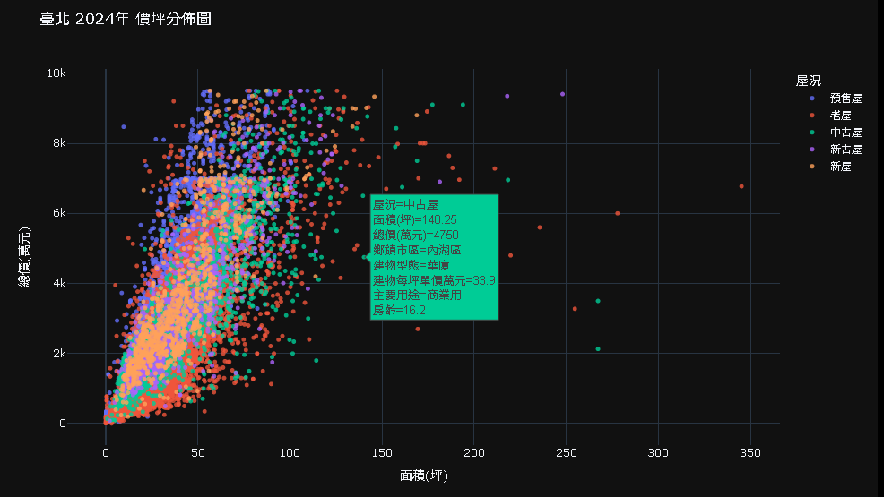
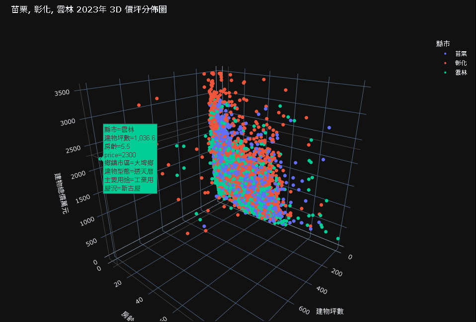
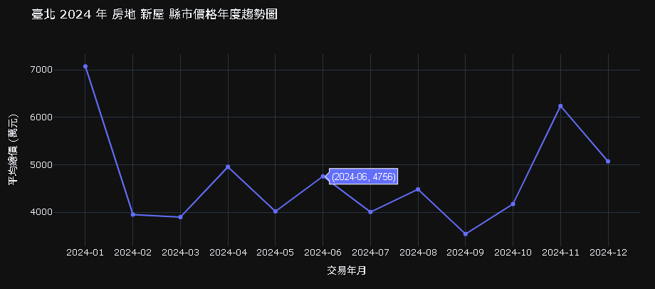
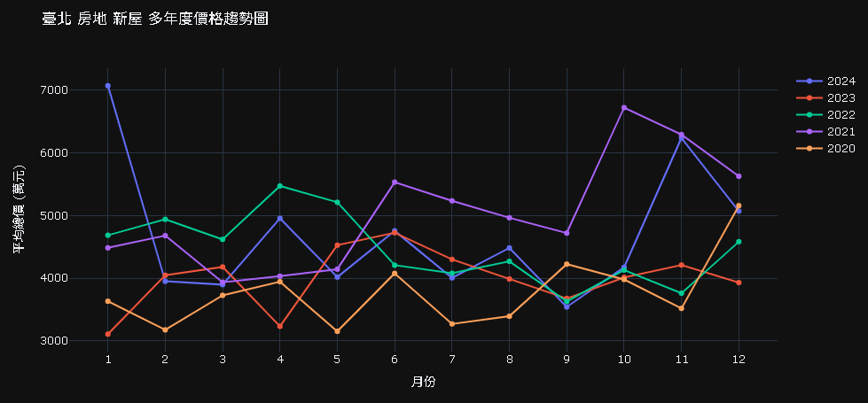
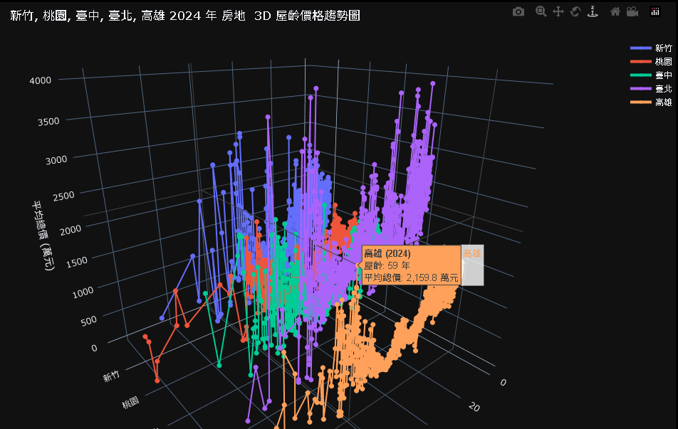

# 🏠 House Insight Dashboard

**House Insight Dashboard** is an interactive data visualization platform that provides in-depth insights into Taiwan's real estate market.  
Built on open transaction data from the Ministry of the Interior, this project allows users to explore housing trends, compare price distributions, and analyze market behavior across regions and years with clarity and precision.

## 📊 Key Visualizations

### 1. 🟢 City Price Distribution Chart

- **Description:** Visualizes the price distribution of real estate based on building area and total price.  
- **Features:** Filter by year, city, property type, and house condition.  
- **Purpose:** Understand the price range across cities and detect outliers or clustering.

### 2. 🔵 3D City Distribution Chart

- **Description:** 3D scatter plot showing building area, total price, and house age across multiple cities in a selected year.  
- **Features:** Interactive WebGL rendering for smooth performance.  
- **Purpose:** Explore complex relationships between price, area, and age across different regions.

### 3. 🟡 City Price Trend Chart

- **Description:** Line chart showing average property prices over the months of a selected year.  
- **Features:** Filter by city, transaction type, and house condition.  
- **Purpose:** Track seasonal price fluctuations within a given year.

### 4. 🟣 Multi-Year Price Trend Chart

- **Description:** Compare monthly price trends across multiple years.  
- **Features:** Visualized by year and month for long-term trend analysis.  
- **Purpose:** Identify macro trends, market cycles, and annual patterns.

### 5. 🟠 3D House Price vs. Building Age — Multi-City Comparison

- **Description:** 3D line chart showing average prices by house age across multiple cities.  
- **Features:** Vertical axis represents different cities for easy comparison.  
- **Purpose:** Analyze how aging properties affect price across regions in a single year.

## 🧹 Data Cleaning & Filtering

To ensure data quality and analytical accuracy, the following preprocessing steps are applied:

- **Remove upper-bound outliers (%):** Exclude a configurable top percentile of high-price records to avoid skewing the analysis.
- **Use median instead of mean:** Median values are used to minimize distortion from extreme values.
- **Remove zero-priced records:** Filters out transactions with a total price of zero to eliminate data entry errors.
- **Limit to transactions under 100 million TWD:** Excludes luxury or bulk transactions that could bias trend analysis.

## 💡 Technologies Used

- **Python** (`pandas`, `plotly`)
- **Plotly Express** & **Graph Objects** for interactive visualizations
- **Data Source:** [Taiwan Real Estate Open Data](https://plvr.land.moi.gov.tw/DownloadOpenData)

## 📷 Visualization Samples

### 🟢 City Price Distribution Chart

### 🔵 3D City Distribution Chart

### 🟡 City Price Trend Chart

### 🟣 Multi-Year Price Trend Chart

### 🟠 3D House Price vs. Building Age — Multi-City Comparison

## 📄 License

This project is licensed under the **[Apache License 2.0](https://www.apache.org/licenses/LICENSE-2.0)** — you are free to use, modify, and distribute it under the terms of this license.

---